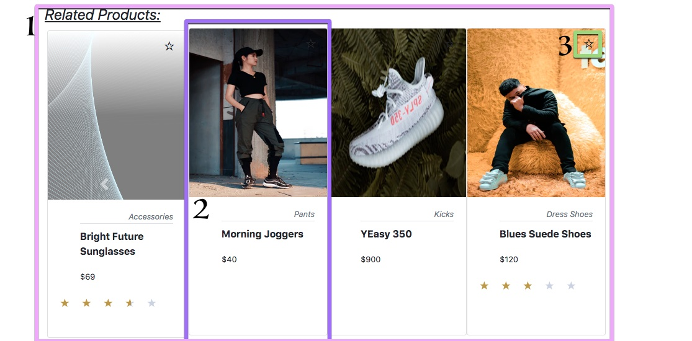
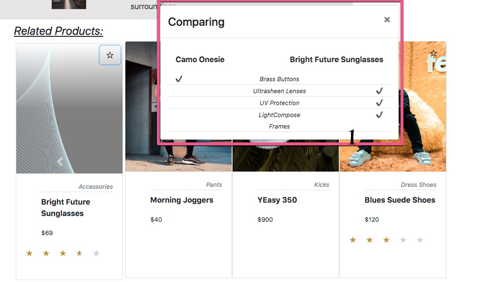
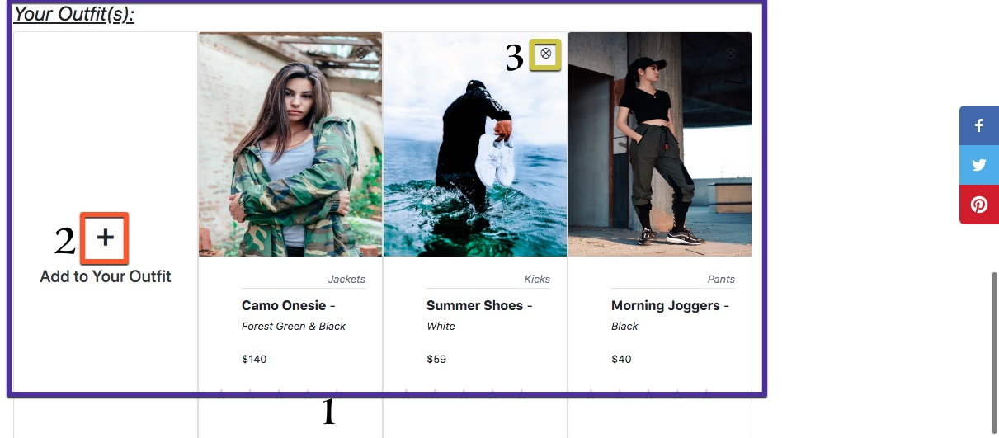

# ---- Project Greenfield - Dream Team Clothing Supply ---- #

# -- Getting Started -- #

# Installation - from project folder
  1. Install dependencies --> npm install
  2. Run webpack --> npm run react-dev
  3. Start server -->
      - cd client/dist -->
        - live-server

# API/Database
  - Host: http://3.134.102.30/
    - End points:
      - Product list: /products/list
      - Product Info: /products/:product_id
      - Product Styles: /products/:product_id/styles
      - Related Products: /products/:product_id/related
      - Reviews: /reviews/:product_id/list
      - Review Meta: /reviews/:product_id/meta

  - DOCS: https://gist.github.com/trentgoing/409c2d76ce8e187e2132e45d9bed4605

# -- Page Flow -- #

# Overview/Product Detail

## -- 1.
  ## - Product images

## -- 2.
  ## - Product Carousel

## -- 3.
  ## - Product Description

## -- 4.
  ## - Style Selector

## -- 5.
  ## - Size/Options

# Related Products

## -- 1.
  ### - Related products component -
  ### -- Displays all products that are related to the current product displayed in the overview.

  ## -- 1.2
  ### - Product Card -
  ### -- Displays the product info summary.
  ### -- Picture from - Product Styles
  ### -- Category from - Product Styles
  ### -- Name from - Product Info
  ### -- Price from - Product Styles
    # - If on sale, sale price is shown in# red
  ### -- Average Rating from - Review Meta

  ## -- 1.3
  ### - Comparison Modal -
  ### -- Pop-up to compare related item with overview item

  ## - Outfit -

  ### -- Allows the user to build an outfit based on displayed overview product

  ## -- 1
  ### - Oufit display

  ## -- 2
  ### - Add to outfit button

  ## -- 3
  ### - Remove from outfit button

# Reviews

##  -- 1.
### - Product Star Rating

## -- 2.
### - Characteristics Rating

## -- 3.
### - Reviews

